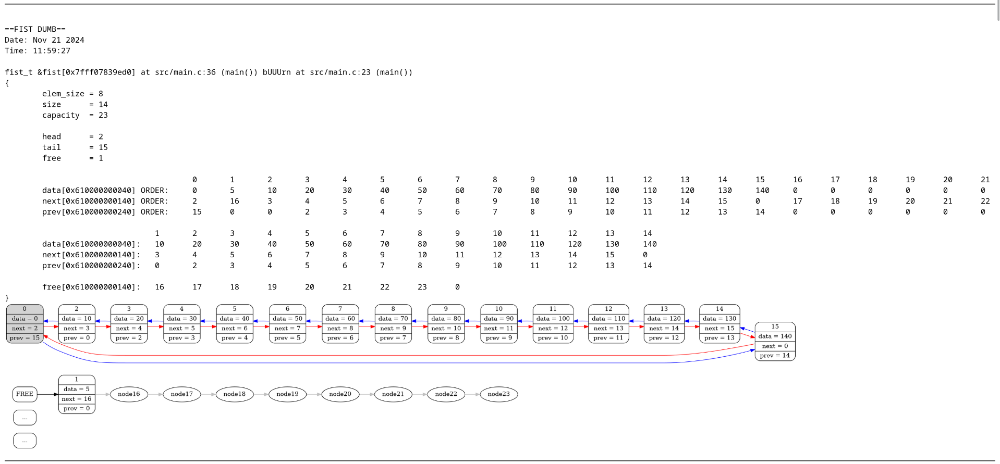

# Fist

**Fist** — это реализация структуры данных, аналогичной списку, но основанной на массиве. Цель проекта — создание более эффективной и производительной альтернативы стандартным спискам, которые используют динамическое выделение памяти для каждого элемента, а также совершенствование своих навыков в написании графических дампов. В отличие от стадартных аналогов, Fist хранит данные в непрерывном блоке памяти, что позволяет избежать фрагментации и улучшить производительность за счет соблюдения приципа локальности и ненадобности в аллокации и уничтожении нод списка при вставке и удалении.

## Установка

### Зависимости
Для работы проекта необходимы следующие инструменты и библиотеки:
- **GCC** (или другой компилятор C).
- **Graphviz** (для генерации графических дампов).
- **Make** (для сборки проекта).

### Сборка проекта
1. Клонируйте репозиторий с проектом:
   ```bash
   git clone https://github.com/kzueirf12345/list_on_array
   cd path/to/list_on_array/
   ```
2. Соберите и запустите проект:
   ```bash
   make
   ```

3. Для сборки в режиме отладки используйте:
   ```bash
   make DEBUG_=1
   ```

## Использование

### Пример работы с Fist
```c
#include "fist/fist.h"

int main() {
    fist_t fist = {};
    FIST_ERROR_HANDLE(FIST_CTOR(&fist, sizeof(size_t), 2));

    size_t elem = 5;
    FIST_ERROR_HANDLE(fist_push(&fist, 0, &elem));

    for (size_t i = 10; i < 150; i += 10) {
        FIST_ERROR_HANDLE(fist_push(&fist, i / 10, &i));
    }

    FIST_ERROR_HANDLE(fist_pop(&fist, 1));
    FIST_DUMB(&fist, NULL);  // Визуализация текущего состояния

    fist_dtor(&fist);
    return 0;
}
```

### Генерация графических дампов
Fist поддерживает генерацию графических дампов в формате PNG с помощью Graphviz. Для этого используется функция `FIST_DUMB`, которая вставляет в HTML-файл визуализацию текущего состояния структуры данных, а если это невозможно, то всегда добавляет текстовый дамп.



## Реализация

### 0. Структура проекта

```
./
├── libs
│   └── logger          # Сабмодуль для логирования
├── src
│   ├── dumb            # Модуль для визуализации и дампов
│   ├── fist            # Основная реализация структуры данных
│   ├── main.c          # Основной файл программы
│   ├── verification    # Модуль для проверки корректности структуры
│   └── verify_utils    # Вспомогательные утилиты для проверки
└── utils               # Вспомогательные утилиты
```

### 1. **Структура данных**

- **`fist_t`**: Основная структура, которая содержит:
  - `data` — массив для хранения элементов.
  - `next` — массив индексов, указывающих на следующий элемент.
  - `prev` — массив индексов, указывающих на предыдущий элемент.
  - `capacity` — максимальное количество элементов, которое может хранить Fist без реаллокации.
  - `size` — текущее количество элементов.
  - `free` — индекс первого свободного элемента.

### 2. **Функции**
- **Конструктор (`fist_ctor`)**: Выделяет память для массивов `data`, `next` и `prev` и устанавливает значения по умолчанию.
- **Деструктор (`fist_ctor`)**: Очищает выделенную динамическую память.
- **Добавление элемента (`fist_push`)**: Вставляет элемент в указанную позицию. Если массив заполнен, автоматически увеличивает его размер.
- **Удаление элемента (`fist_pop`)**: Удаляет элемент по указанному индексу и добавляет его в список свободных элементов.
- **Линеаризация (`fist_linearize`)**: Отсортировывает элементы списка в прямом порядке. Может использоваться для ускорения прямого обхода посредством встроенного механизма branch prediction.

### 4. **Логирование**
В проекте используется сабмодуль `logger`, который предоставляет удобные инструменты для логирования ошибок и отладки. Логи сохраняются в файл `logout.log`.

### 5. **Верификация и обработка ошибок**

#### Верификация в режиме дебага
В проекте реализован макрос `FIST_VERIFY`, который проверяет корректность структуры данных `fist_t` в режиме отладки (иначе раскрывается в пустоту). Эта функция выполняет следующие проверки:
- **Проверка указателей**: Убеждается, что указатели на массивы `data`, `next` и `prev` не равны `NULL` и не содержат недопустимых значений.
- **Проверка размеров**: Проверяет, что размер элемента (`elem_size`) и вместимость (`capacity`) не равны нулю, а также что количество элементов (`size`) не превышает вместимость.
- **Проверка связности**: Проверяет, что индексы в массивах `next` и `prev` не выходят за пределы допустимого диапазона и корректно связывают элементы.
- **Проверка свободных элементов**: Убеждается, что свободные элементы (`free`) корректно связаны между собой и не пересекаются с используемыми элементами.

Если верификация обнаруживает ошибку, она возвращает соответствующий код ошибки. В режиме отладки макрос `FIST_VERIFY` автоматически вызывает функцию верификации и, в случае ошибки, создает графический дамп текущего состояния структуры данных с помощью `FIST_DUMB`, а также завершает программу с соответствующи сообщением об ошибке.

#### Список кодов ошибок

| Название ошибки                     | Код ошибки | Описание                                                                 |
|--------------------------------|----------|-------------------------------------------------------------------------|
| `FIST_ERROR_SUCCESS`            | 0        | Успешное выполнение операции.                                           |
| `FIST_ERROR_STANDARD_ERRNO`     | 1        | Ошибка, связанная с системными вызовами (например, `malloc` или `fopen`).|
| `FIST_ERROR_FIST_IS_NULL`       | 2        | Указатель на структуру `fist_t` равен `NULL`.                           |
| `FIST_ERROR_FIST_IS_NVALID`     | 3        | Указатель на структуру `fist_t` некорректен.                            |
| `FIST_ERROR_DATA_IS_NULL`       | 4        | Указатель на массив `data` равен `NULL`.                                |
| `FIST_ERROR_DATA_IS_NVALID`     | 5        | Указатель на массив `data` некорректен.                                 |
| `FIST_ERROR_NEXT_IS_NULL`       | 6        | Указатель на массив `next` равен `NULL`.                                |
| `FIST_ERROR_NEXT_IS_NVALID`     | 7        | Указатель на массив `next` некорректен.                                 |
| `FIST_ERROR_PREV_IS_NULL`       | 8        | Указатель на массив `prev` равен `NULL`.                                |
| `FIST_ERROR_PREV_IS_NVALID`     | 9        | Указатель на массив `prev` некорректен.                                 |
| `FIST_ERROR_ELEM_SIZE_IS_ZERO`  | 10       | Размер элемента (`elem_size`) равен нулю.                               |
| `FIST_ERROR_NEXT_NVALID`        | 11       | Некорректная связь элементов в массиве `next`.                          |
| `FIST_ERROR_PREV_NVALID`        | 12       | Некорректная связь элементов в массиве `prev`.                          |
| `FIST_ERROR_NEXT_ELEM_OVERFLOW` | 13       | Индекс в массиве `next` выходит за пределы допустимого диапазона.       |
| `FIST_ERROR_PREV_ELEM_OVERFLOW` | 14       | Индекс в массиве `prev` выходит за пределы допустимого диапазона.       |
| `FIST_ERROR_FREE_ELEM_OVERFLOW` | 15       | Индекс свободного элемента выходит за пределы допустимого диапазона.    |
| `FIST_ERROR_FREE_INTERSECT_NEXT`| 16       | Свободные элементы пересекаются с используемыми элементами.             |
| `FIST_ERROR_FREE_NCOMPLETE`     | 17       | Количество свободных элементов не соответствует ожидаемому.             |
| `FIST_ERROR_SIZE_BIGGER_CAPACITY`| 18      | Количество элементов (`size`) превышает вместимость (`capacity`).      |
| `FIST_ERROR_CAPACITY_IS_ZERO`   | 19       | Вместимость (`capacity`) равна нулю.                                    |
| `FIST_ERROR_POP_ARG_NVALID`     | 20       | Некорректный аргумент при удалении элемента.                            |
| `FIST_ERROR_FREE_CIRCLE`        | 21       | Обнаружена циклическая связь в списке свободных элементов.              |
| `FIST_ERROR_LOGGER_ERROR`       | 22       | Ошибка в работе логгера.                                                |
| `FIST_ERROR_UNKNOWN`            | 30       | Неизвестная ошибка.                                                     |

В проект активно используются макросы для обработки ошибок, такие как `FIST_ERROR_HANDLE` и `DUMB_ERROR_HANDLE`. Рекомендуется использовать их в ваших проектах.
